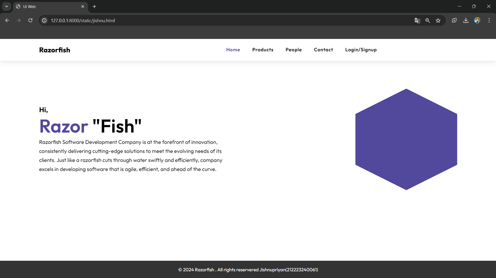
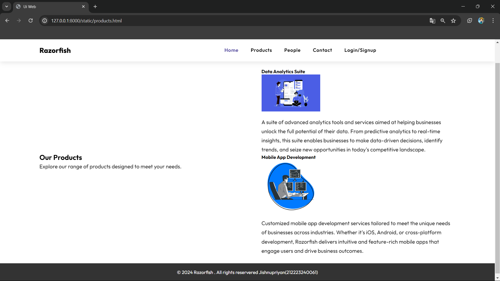
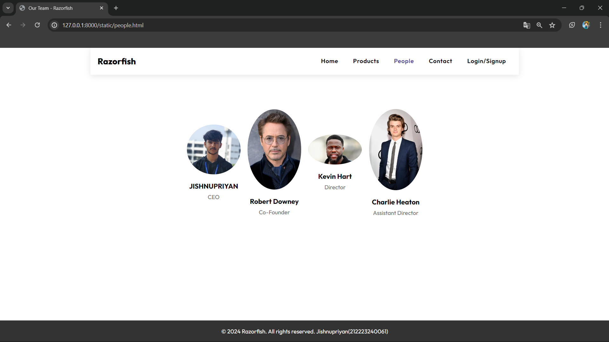
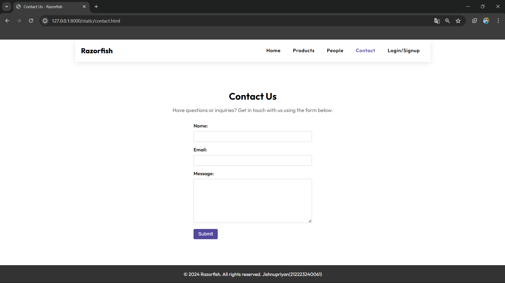
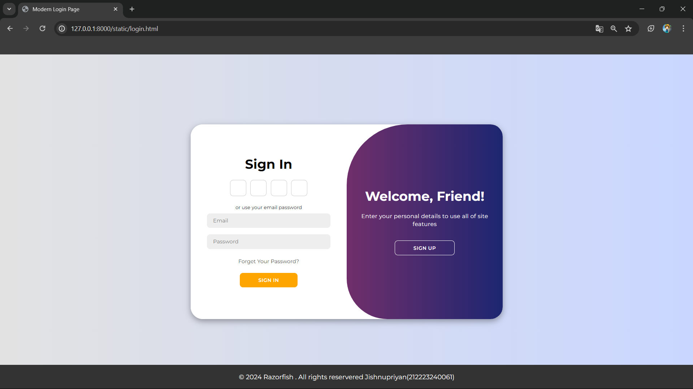

# Ex.07 Software Product Company Website
## Date:7-5-24

## AIM:
To develop a static company website to display the softwares and services provided by the company.

## DESIGN STEPS:

### Step 1:
Requirement collection.

### Step 2:
Creating the layout using HTML and CSS.

### Step 3:
Updating the sample content.

### Step 4:
Choose the appropriate style and color scheme.

### Step 5:
Validate the layout in various browsers.

### Step 6:
Validate the HTML code.

### Step 7:
Publish the website in the given URL.

## PROGRAM:
## jishnu.html
```
<!DOCTYPE html>
<html lang="en">
<head>
    <meta charset="UTF-8">
    <meta name="viewport" content="width=device-width, initial-scale=1.0">
    <title>Ui Web</title>
   <style>

@import url('https://fonts.googleapis.com/css2?family=Poppins:wght@100;200;300;400;500;600;700;800&display=swap');
@import url('https://fonts.googleapis.com/css2?family=Outfit:wght@200;300;400;500;600;700;800&family=Roboto:wght@100;300;400&display=swap');

:root {
    /* --primary-color: #f9532d; */
    /* --primary-dark: #1F252E; */
    --primary-color: #52489C;
    --primary-dark: #1F252E;
}

* {
    margin: 0;
    padding: 0;
    scroll-behavior: smooth;
}

body {
    font-family: 'Outfit', sans-serif;
    background: #ffffff;
    height: 100vh;
    color: #000;
    display: flex;
    justify-content: center;
}

/* Genral */
.container {
    padding: 0 8.4rem;
}

.img-w {
    width: 100%;
    height: auto;
}

/* Nav */
header {
    box-shadow: 0 4px 17px rgba(0, 0, 0, .1);
    background: #fff;
    position: sticky;
    top: 0;
    z-index: 1;
}

.page-header {
    display: flex;
    justify-content: space-between;
    align-items: center;
    padding: 1rem 0;
}

.logo {
    font-size: 1.5rem;
    font-weight: 800;
    opacity: 0;
    animation: leftSideAni 1s ease forwards;
}

.logo a {
    color: #000;
    text-decoration: none;
}

ul {
    display: flex;
    gap: .6rem;
    list-style-type: none;
    background-color: transparent;
    overflow: hidden;
}

li a {
    display: inline-block;
    padding: .3rem 1rem;
    color: #000;
    text-decoration: none;
    font-size: 1.05rem;
    font-weight: 600;
    letter-spacing: .7px;
    border-radius: 36px;
    line-height: 2;
    transition: .3s;
    opacity: 0;
    animation: navani .3s ease forwards;
    animation-delay: calc(.15s * var(--navAni));
}

li a.active,
li a:hover {
    color: var(--primary-color);
}

#click {
    display: none;
}

.menu {
    display: none;
}

.mode i {
    font-size: 1.4rem;
    cursor: pointer;
    color: var(--primary-color);
    opacity: 0;
    animation: rightSideAni 1.5s ease forwards;
}

/* Nav End */

/* Section 1 */

.main {
    padding: 6rem 0;
    display: grid;
    grid-template-columns: repeat(auto-fit, minmax(277px, 1fr));
    row-gap: 2rem;
    column-gap: 6rem;
    align-items: center;
}

.main h3 {
    color: #000;
    font-size: 1.5rem;
    opacity: 0;
    animation: topSideAni 1s ease forwards;
}

.main h1 {
    color: #000;
    font-size: 4rem;
    font-weight: 600;
    opacity: 0;
    animation: leftSideAni 1s ease forwards;
    animation-delay: 1s;
}
.main p {
    line-height: 1.7;
    font-size: 1.15rem;
    opacity: 0;
    animation: topSideAni 1.5s ease forwards;
}
.social {
    display: flex;
    flex-wrap: wrap;
    gap: 1.4rem;
    margin-top: 1.4rem;
}

.social a {
    clip-path: polygon(50% 0%, 100% 25%, 100% 75%, 50% 100%, 0% 75%, 0% 25%);
    display: grid;
    place-items: center;
    text-decoration: none;
    background-color: var(--primary-color);
    color: #ffffff;
    /* border: 1.6px solid var(--primary-color); */
    font-size: 1.5rem;
    border-radius: 50%;
    padding: 0.39rem;
    text-align: center;
    opacity: 0;
    animation: SocialAni 1s ease forwards;
    animation-delay: calc(.2s * var(--socialAni));
}

.social a:hover {
    color: var(--primary-dark);
    background-color: var(--primary-color);
    box-shadow: 0 0 20px var(--primary-color);
    transition: all .3s ease-in-out;
}


.images {
    margin-left: auto;
    width: 350px;
    height: 350px;
    text-align: center;
    overflow: hidden;
    background-color: #52489C;
    clip-path: polygon(50% 0%, 100% 25%, 100% 75%, 50% 100%, 0% 75%, 0% 25%);
}

/* Section 1 End */


.dark-mode {
    background-color: var(--primary-dark);
    color: #ffffff;
}

.mode input {
    display: none;
}

.dark-mode .logo a, 
.dark-mode ul li a, 
.dark-mode .main h3, 
.dark-mode .main h1 {
    color: #fff;
}
.dark-mode ul li a.active, .dark-mode ul li a:hover {
    color: var(--primary-color);
}

.dark-mode header {
    box-shadow: 0 4px 17px rgb(80 80 80 / 31%);
    background: var(--primary-dark);
}


/* Animation */
@keyframes leftSideAni {
    0% {
        transform: translateX(-100px);
        opacity: 0;
    }

    100% {
        transform: translateX(0);
        opacity: 1;
    }
}

@keyframes navani {
    0% {
        transform: translateY(100px);
        opacity: 0;
    }

    100% {
        transform: translateY(0);
        opacity: 1;
    }
}

@keyframes rightSideAni {
    0% {
        transform: translateX(100px);
        opacity: 0;
    }

    100% {
        transform: translateX(0);
        opacity: 1;
    }
}

@keyframes topSideAni {
    0% {
        transform: translateY(-100px);
        opacity: 0;
    }

    100% {
        transform: translateY(0);
        opacity: 1;
    }
}

@keyframes SocialAni {
    0% {
        transform: translateY(100px);
        opacity: 0;
    }

    100% {
        transform: translateY(0);
        opacity: 1;
    }
}

/* @keyframes ImgAni {
    0% {
        transform: translateX(0);
    }
    50% {
        transform: translateX(-9px);
    }
    100% {
        transform: translateX(0);
    }
} */

@keyframes imageAni {
    0% {
        opacity: 0;
        transform: scale(0);
    }

    100% {
        opacity: 1;
        transform: scale(1);
    }
}

@media screen and (max-width: 1024px) {
    .container {
        padding: 0 4.4rem;
    }

    .main h3 {
        color: #000;
        margin-top: 1rem;
    }
}

@media screen and (max-width: 768px) {
    .container {
        padding: 0 1.6rem;
    }
}

@media screen and (max-width:600px) {
    body {
        height: auto;
    }

    header {
        height: auto;
    }

    ul {
        background: var(--primary-dark);
        width: 100%;
        height: 100vh;
        position: absolute;
        display: flex;
        flex-direction: column;
        text-align: center;
        top: 3.4rem;
        left: -100%;
        z-index: 111111;
    }

    .menu {
        display: block;
        font-size: 1.5rem;
        font-weight: bold;
        color: #244D61;
    }

    #click:checked~ul {
        left: 0%;
        transition: all 0.3s ease;
    }
    .dark-mode .menu {
        color: var(--primary-color);
    }

    .dark-mode ul {
        background: var(--primary-dark);
    }

    .mode {
        position: absolute;
        right: 4rem;
    }
    .images {
        width: 100%;
        margin: auto;
    }

    .main {
        margin-top: 2rem;
    }
}
footer{
    position: fixed;
    bottom: 0;
    width: 100%;
    background-color: #333;
    color: #fff;
    text-align: center;
    padding: 20px 0;
 }

   </style>
</head>
<body>
    <section>
        <header class="container">
            <div class="page-header">
                <div class="logo">
                    <a href="#">Razorfish</a>
                </div>
                <input type="checkbox" id="click">
                <label for="click" class="mainicon">
                    <div class="menu">
                        <i class="fa-solid fa-bars"></i>
                    </div>
                </label>
                <ul>
                <li><a href="jishnu.html" class="active" style="--navAni:1">Home</a></li>
                <li><a href="products.html" style="--navAni:2">Products</a></li>
                <li><a href="people.html" style="--navAni:3">People</a></li>
                <li><a href="contact.html" style="--navAni:5">Contact</a></li>
                <li><a href="login.html" style="--navAni:6">Login/Signup</a></li>
            </ul>
            <label class="mode">
                <input type="checkbox" id="darkModeToggle">
                <i class="fa-solid fa-moon"></i>
            </label>
            </div>
        </header>
        <div class="container">
            <div class="main">
                <div class="detail">
                    <h3>Hi,</h3>
                    <h1>
                        <span style="color:#52489C;">Razor</span>
                        "Fish"
                    </h1>
                    <p>
                      Razorfish Software Development Company is at the forefront of innovation, consistently delivering cutting-edge solutions to meet the evolving needs of its clients. Just like a razorfish cuts through water swiftly and efficiently,
                       company excels in developing software that is agile, efficient, and ahead of the curve.
                    </p>
                    
                </div>
                <div class="images">
                    
                </div>
            </div>
        </div>
    </section>
    <script>

      
const darkModeToggle = document.getElementById('darkModeToggle');
        const body = document.body;
        const isDarkMode = localStorage.getItem('darkMode') === 'enabled';
        if (isDarkMode){
            body.classList.add('dark-mode');
            darkModeToggle.checked = true;
        }
        darkModeToggle.addEventListener('change', () => {
            if (darkModeToggle.checked){
                body.classList.add('dark-mode');
                localStorage.setItem('darkMode', 'enabled');
            }
            else{
                body.classList.remove('dark-mode');
                localStorage.setItem('darkMode', 'disabled')
            }
        });
   
    </script>
    <footer>
        &copy; 2024 Razorfish . All rights reservered Jishnupriyan(212223240061)
    </footer>
</body>
</html>
```

## Products.html
```
<!DOCTYPE html>
<html lang="en">
<head>
    <meta charset="UTF-8">
    <meta name="viewport" content="width=device-width, initial-scale=1.0">
    <title>Ui Web</title>
   <style>

@import url('https://fonts.googleapis.com/css2?family=Poppins:wght@100;200;300;400;500;600;700;800&display=swap');
@import url('https://fonts.googleapis.com/css2?family=Outfit:wght@200;300;400;500;600;700;800&family=Roboto:wght@100;300;400&display=swap');

:root {
    --primary-color: #52489C;
    --primary-dark: #1F252E;
}

* {
    margin: 0;
    padding: 0;
    scroll-behavior: smooth;
}

body {
    font-family: 'Outfit', sans-serif;
    background: #ffffff;
    height: 100vh;
    color: #000;
    display: flex;
    justify-content: center;
}

.container {
    padding: 0 8.4rem;
}

.img-w {
    width: 100%;
    height: auto;
}

header {
    box-shadow: 0 4px 17px rgba(0, 0, 0, .1);
    background: #fff;
    position: sticky;
    top: 0;
    z-index: 1;
}

.page-header {
    display: flex;
    justify-content: space-between;
    align-items: center;
    padding: 1rem 0;
}

.logo {
    font-size: 1.5rem;
    font-weight: 800;
    opacity: 0;
    animation: leftSideAni 1s ease forwards;
}

.logo a {
    color: #000;
    text-decoration: none;
}

ul {
    display: flex;
    gap: .6rem;
    list-style-type: none;
    background-color: transparent;
    overflow: hidden;
}

li a {
    display: inline-block;
    padding: .3rem 1rem;
    color: #000;
    text-decoration: none;
    font-size: 1.05rem;
    font-weight: 600;
    letter-spacing: .7px;
    border-radius: 36px;
    line-height: 2;
    transition: .3s;
    opacity: 0;
    animation: navani .3s ease forwards;
    animation-delay: calc(.15s * var(--navAni));
}

li a.active,
li a:hover {
    color: var(--primary-color);
}

#click {
    display: none;
}

.menu {
    display: none;
}

.mode i {
    font-size: 1.4rem;
    cursor: pointer;
    color: var(--primary-color);
    opacity: 0;
    animation: rightSideAni 1.5s ease forwards;
}

.main {
    padding: 6rem 0;
    display: grid;
    grid-template-columns: repeat(auto-fit, minmax(277px, 1fr));
    row-gap: 2rem;
    column-gap: 6rem;
    align-items: center;
}

.main h3 {
    color: #000;
    font-size: 1.5rem;
    opacity: 0;
    animation: topSideAni 1s ease forwards;
}

.main h1 {
    color: #000;
    font-size: 4rem;
    font-weight: 600;
    opacity: 0;
    animation: leftSideAni 1s ease forwards;
    animation-delay: 1s;
}

.main p {
    line-height: 1.7;
    font-size: 1.15rem;
    opacity: 0;
    animation: topSideAni 1.5s ease forwards;
}

.social {
    display: flex;
    flex-wrap: wrap;
    gap: 1.4rem;
    margin-top: 1.4rem;
}

.social a {
    clip-path: polygon(50% 0%, 100% 25%, 100% 75%, 50% 100%, 0% 75%, 0% 25%);
    display: grid;
    place-items: center;
    text-decoration: none;
    background-color: var(--primary-color);
    color: #ffffff;
    font-size: 1.5rem;
    border-radius: 50%;
    padding: 0.39rem;
    text-align: center;
    opacity: 0;
    animation: SocialAni 1s ease forwards;
    animation-delay: calc(.2s * var(--socialAni));
}

.social a:hover {
    color: var(--primary-dark);
    background-color: var(--primary-color);
    box-shadow: 0 0 20px var(--primary-color);
    transition: all .3s ease-in-out;
}

.images {
    margin-left: auto;
    width: 350px;
    height: 350px;
    text-align: center;
    overflow: hidden;
    background-color: #52489C;
    clip-path: polygon(50% 0%, 100% 25%, 100% 75%, 50% 100%, 0% 75%, 0% 25%);
}

.dark-mode {
    background-color: var(--primary-dark);
    color: #ffffff;
}

.mode input {
    display: none;
}

.dark-mode .logo a, 
.dark-mode ul li a, 
.dark-mode .main h3, 
.dark-mode .main h1 {
    color: #fff;
}

.dark-mode ul li a.active, .dark-mode ul li a:hover {
    color: var(--primary-color);
}

.dark-mode header {
    box-shadow: 0 4px 17px rgb(80 80 80 / 31%);
    background: var(--primary-dark);
}

@keyframes leftSideAni {
    0% {
        transform: translateX(-100px);
        opacity: 0;
    }

    100% {
        transform: translateX(0);
        opacity: 1;
    }
}

@keyframes navani {
    0% {
        transform: translateY(100px);
        opacity: 0;
    }

    100% {
        transform: translateY(0);
        opacity: 1;
    }
}

@keyframes rightSideAni {
    0% {
        transform: translateX(100px);
        opacity: 0;
    }

    100% {
        transform: translateX(0);
        opacity: 1;
    }
}

@keyframes topSideAni {
    0% {
        transform: translateY(-100px);
        opacity: 0;
    }

    100% {
        transform: translateY(0);
        opacity: 1;
    }
}

@keyframes SocialAni {
    0% {
        transform: translateY(100px);
        opacity: 0;
    }

    100% {
        transform: translateY(0);
        opacity: 1;
    }
}

@media screen and (max-width: 1024px) {
    .container {
        padding:0 4.4rem;
    }

    .main h3 {
        color: #000;
        margin-top: 1rem;
    }
}

@media screen and (max-width: 768px) {
    .container {
        padding: 0 1.6rem;
    }
}

@media screen and (max-width:600px) {
    body {
        height: auto;
    }

    header {
        height: auto;
    }

    ul {
        background: var(--primary-dark);
        width: 100%;
        height: 100vh;
        position: absolute;
        display: flex;
        flex-direction: column;
        text-align: center;
        top: 3.4rem;
        left: -100%;
        z-index: 111111;
    }

    .menu {
        display: block;
        font-size: 1.5rem;
        font-weight: bold;
        color: #244D61;
    }

    #click:checked~ul {
        left: 0%;
        transition: all 0.3s ease;
    }

    .dark-mode .menu {
        color: var(--primary-color);
    }

    .dark-mode ul {
        background: var(--primary-dark);
    }

    .mode {
        position: absolute;
        right: 4rem;
    }

    .images {
        width: 100%;
        margin: auto;
    }

    .main {
        margin-top: 2rem;
    }
}
.product img {
    max-width: 200px; /* Adjust as needed */
    height: auto; /* Maintain aspect ratio */
    margin-bottom: 1rem; /* Add some space below the image */
}
 footer{
    position: fixed;
    bottom: 0;
    width: 100%;
    background-color: #333;
    color: #fff;
    text-align: center;
    padding: 20px 0;
 }

   </style>
</head>
<body>
        <section>
            <header class="container">
                <div class="page-header">
                    <div class="logo">
                        <a href="#">Razorfish</a>
                    </div>
                    <input type="checkbox" id="click">
                    <label for="click" class="mainicon">
                        <div class="menu">
                            <i class="fa-solid fa-bars"></i>
                        </div>
                    </label>
                    <ul>
                        <li><a href="jishnu.html" class="active" style="--navAni:1">Home</a></li>
                        <li><a href="products.html" style="--navAni:2">Products</a></li>
                        <li><a href="people.html" style="--navAni:3">People</a></li>
                        <li><a href="contact.html" style="--navAni:5">Contact</a></li>
                        <li><a href="login.html" style="--navAni:6">Login/Signup</a></li>
                    </ul>
                    <label class="mode">
                        <input type="checkbox" id="darkModeToggle">
                        <i class="fa-solid fa-moon"></i>
                    </label>
                </header>
                <section id="products">
                    <div class="container">
                        <div class="main">
                            <div class="detail">
                                <h3>Our Products</h3>
                                <p>Explore our range of products designed to meet your needs.</p>
                            </div>
                            <div class="product-list">
                                <div class="product">
                                    <h4>Data Analytics Suite</h4>
                                    
                                    <p>A suite of advanced analytics tools and services aimed at helping businesses unlock the 
                                        full potential of their data. From predictive analytics to real-time insights, this suite enables businesses to make 
                                        data-driven decisions, identify trends, and seize new opportunities in today's competitive landscape.</p>
                                </div>
                                <div class="product">
                                    <h4>Mobile App Development</h4>
                                    
                                    <p>Customized mobile app development services tailored to meet the unique needs of businesses across industries. 
                                        Whether it's iOS, Android, or cross-platform development, 
                                        Razorfish delivers intuitive and feature-rich mobile apps that engage users and drive business outcomes.</p>
                                </div>
                                <!-- Add more product items as needed -->
                            </div>
                        </div>
                    </div>
                </section>
                
    <script>
        const darkModeToggle = document.getElementById('darkModeToggle');
        const body = document.body;
        const isDarkMode = localStorage.getItem('darkMode') === 'enabled';
        if (isDarkMode){
            body.classList.add('dark-mode');
            darkModeToggle.checked = true;
        }
        darkModeToggle.addEventListener('change', () => {
            if (darkModeToggle.checked){
                body.classList.add('dark-mode');
                localStorage.setItem('darkMode', 'enabled');
            }
            else{
                body.classList.remove('dark-mode');
                localStorage.setItem('darkMode', 'disabled')
            }
        });
    </script>
    <footer>
        &copy; 2024 Razorfish . All rights reservered Jishnupriyan(212223240061)
    </footer>
</body>
</html>

```

## People.html
```
<!DOCTYPE html>
<html lang="en">
<head>
    <meta charset="UTF-8">
    <meta name="viewport" content="width=device-width, initial-scale=1.0">
    <title>Our Team - Razorfish</title>
    <style>

@import url('https://fonts.googleapis.com/css2?family=Poppins:wght@100;200;300;400;500;600;700;800&display=swap');
@import url('https://fonts.googleapis.com/css2?family=Outfit:wght@200;300;400;500;600;700;800&family=Roboto:wght@100;300;400&display=swap');


        * {
            margin: 0;
            padding: 0;
            box-sizing: border-box;
        }
        
        body {
            font-family: 'Outfit', sans-serif;
            background: #ffffff;
            color: #000;
        }
        
        .container {
            max-width: 1200px;
            margin: 0 auto;
            padding: 0 20px;
        }
        
        header {
            box-shadow: 0 4px 17px rgba(0, 0, 0, .1);
            background: #fff;
            position: sticky;
            top: 0;
            z-index: 1;
        }
        
        .page-header {
            display: flex;
            justify-content: space-between;
            align-items: center;
            padding: 1rem 0;
        }
        
        .logo {
            font-size: 1.5rem;
            font-weight: 800;
        }
        
        .logo a {
            color: #000;
            text-decoration: none;
        }
        
        ul {
            display: flex;
            gap: .6rem;
            list-style-type: none;
            background-color: transparent;
            overflow: hidden;
        }
        
        li a {
            display: inline-block;
            padding: .3rem 1rem;
            color: #000;
            text-decoration: none;
            font-size: 1.05rem;
            font-weight: 600;
            letter-spacing: .7px;
            border-radius: 36px;
            line-height: 2;
            transition: .3s;
        }
        
        li a.active,
        li a:hover {
            color: #52489C;
        }
        
        #team {
            padding: 6rem 0;
        }
        
        .main {
            display: flex;
            justify-content: center;
            align-items: center;
            flex-wrap: wrap;
            gap: 20px;
        }
        
        .member {
            text-align: center;
            max-width: 200px;
        }
        
        .member img {
            width: 100%;
            max-width: 150px;
            height: auto;
            border-radius: 50%;
            margin-bottom: 1rem;
        }
        
        .member h4 {
            margin-bottom: 0.5rem;
            font-size: 1.2rem;
        }
        
        .member p {
            margin-bottom: 1rem;
            font-size: 1rem;
            color: #666;
        }
        
        footer {
            background-color: #333;
            color: #fff;
            text-align: center;
            padding: 20px 0;
            position: fixed;
            bottom: 0;
            width: 100%;
        }
    </style>
</head>
<body>
    <section>
        <header class="container">
            <div class="page-header">
                <div class="logo">
                    <a href="#">Razorfish</a>
                </div>
                <ul>
                    <li><a href="jishnu.html">Home</a></li>
                    <li><a href="products.html">Products</a></li>
                    <li><a href="people.html" class="active">People</a></li>
                    <li><a href="contact.html">Contact</a></li>
                    <li><a href="login.html">Login/Signup</a></li>
                </ul>
            </div>
        </header>
    </section>
    
    <section id="team">
        <div class="container">
            <div class="main">
                <div class="member">
                    
                    <h4>JISHNUPRIYAN</h4>
                    <p>CEO</p>
                </div>
                <div class="member">
                    
                    <h4>Robert Downey</h4>
                    <p>Co-Founder</p>
                </div>
                <div class="member">
                    
                    <h4>Kevin Hart</h4>
                    <p>Director</p>
                </div>
                <div class="member">
                    
                    <h4>Charlie Heaton</h4>
                    <p>Assistant Director</p>
                </div>
            </div>
        </div>
    </section>
    
    <footer>
        &copy; 2024 Razorfish. All rights reserved. Jishnupriyan(212223240061)
    </footer>
</body>
</html>
```

## Contact.html
```
<!DOCTYPE html>
<html lang="en">
<head>
    <meta charset="UTF-8">
    <meta name="viewport" content="width=device-width, initial-scale=1.0">
    <title>Contact Us - Razorfish</title>
    
    <style>
        @import url('https://fonts.googleapis.com/css2?family=Poppins:wght@100;200;300;400;500;600;700;800&display=swap');
@import url('https://fonts.googleapis.com/css2?family=Outfit:wght@200;300;400;500;600;700;800&family=Roboto:wght@100;300;400&display=swap');

        * {
            margin: 0;
            padding: 0;
            box-sizing: border-box;
        }
        
        body {
            font-family: 'Outfit', sans-serif;
            background: #ffffff;
            color: #000;
        }
        
        .container {
            max-width: 1200px;
            margin: 0 auto;
            padding: 0 20px;
        }
        
        header {
            box-shadow: 0 4px 17px rgba(0, 0, 0, .1);
            background: #fff;
            position: sticky;
            top: 0;
            z-index: 1;
        }
        
        .page-header {
            display: flex;
            justify-content: space-between;
            align-items: center;
            padding: 1rem 0;
        }
        
        .logo {
            font-size: 1.5rem;
            font-weight: 800;
        }
        
        .logo a {
            color: #000;
            text-decoration: none;
        }
        
        ul {
            display: flex;
            gap: .6rem;
            list-style-type: none;
            background-color: transparent;
            overflow: hidden;
        }
        
        li a {
            display: inline-block;
            padding: .3rem 1rem;
            color: #000;
            text-decoration: none;
            font-size: 1.05rem;
            font-weight: 600;
            letter-spacing: .7px;
            border-radius: 36px;
            line-height: 2;
            transition: .3s;
        }
        
        li a.active,
        li a:hover {
            color: #52489C;
        }
        
        #contact {
            padding: 6rem 0;
        }
        
        .main {
            display: flex;
            flex-direction: column;
            align-items: center;
        }
        
        .detail {
            text-align: center;
            margin-bottom: 2rem;
        }
        
        .detail h3 {
            font-size: 2rem;
            margin-bottom: 1rem;
        }
        
        .detail p {
            font-size: 1.1rem;
            color: #666;
        }
        
        form {
            max-width: 400px;
            width: 100%;
        }
        
        label {
            font-weight: 600;
            margin-bottom: 0.5rem;
            display: block;
        }
        
        input[type="text"],
        input[type="email"],
        textarea {
            width: 100%;
            padding: 0.5rem;
            margin-bottom: 1rem;
            border: 1px solid #ccc;
            border-radius: 4px;
            font-size: 1rem;
        }
        
        textarea {
            resize: vertical;
            height: 150px;
        }
        
        input[type="submit"] {
            background-color: #52489C;
            color: #fff;
            border: none;
            padding: 0.5rem 1rem;
            font-size: 1rem;
            border-radius: 4px;
            cursor: pointer;
            transition: background-color 0.3s ease;
        }
        
        input[type="submit"]:hover {
            background-color: #463d82;
        }
        
        footer {
            background-color: #333;
            color: #fff;
            text-align: center;
            padding: 20px 0;
            position: fixed;
            bottom: 0;
            width: 100%;
        }
    </style>
</head>
<body>
    <section>
        <header class="container">
            <div class="page-header">
                <div class="logo">
                    <a href="#">Razorfish</a>
                </div>
                <ul>
                    <li><a href="jishnu.html">Home</a></li>
                    <li><a href="products.html">Products</a></li>
                    <li><a href="people.html">People</a></li>
                    <li><a href="contact.html" class="active">Contact</a></li>
                    <li><a href="login.html">Login/Signup</a></li>
                </ul>
            </div>
        </header>
    </section>
    
    <section id="contact">
        <div class="container">
            <div class="main">
                <div class="detail">
                    <h3>Contact Us</h3>
                    <p>Have questions or inquiries? Get in touch with us using the form below.</p>
                </div>
                <form action="#" method="POST">
                    <label for="name">Name:</label>
                    <input type="text" id="name" name="name" required><br>
                    <label for="email">Email:</label>
                    <input type="email" id="email" name="email" required><br>
                    <label for="message">Message:</label>
                    <textarea id="message" name="message" rows="4" required></textarea><br>
                    <input type="submit" value="Submit">
                </form>
            </div>
        </div>
    </section>
    
    <footer>
        &copy; 2024 Razorfish. All rights reserved. Jishnupriyan(212223240061)
    </footer>
</body>
</html>
```

## Login.html
```
<!DOCTYPE html>
<html lang="en">

<head>
    <meta charset="UTF-8">
    <meta name="viewport" content="width=device-width, initial-scale=1.0">
    <title>Modern Login Page</title>
    <style>
            @import url('https://fonts.googleapis.com/css2?family=Montserrat:wght@300;400;500;600;700&display=swap');

*{
    margin: 0;
    padding: 0;
    box-sizing: border-box;
    font-family: 'Montserrat', sans-serif;
}

body{
    background-color: #c9d6ff;
    background: linear-gradient(to right, #e2e2e2, #c9d6ff);
    display: flex;
    align-items: center;
    justify-content: center;
    flex-direction: column;
    height: 100vh;
}

.container{
    background-color: #fff;
    border-radius: 30px;
    box-shadow: 0 5px 15px rgba(0, 0, 0, 0.35);
    position: relative;
    overflow: hidden;
    width: 768px;
    max-width: 100%;
    min-height: 480px;
}

.container p{
    font-size: 14px;
    line-height: 20px;
    letter-spacing: 0.3px;
    margin: 20px 0;
}

.container span{
    font-size: 12px;
}

.container a{
    color: #333;
    font-size: 13px;
    text-decoration: none;
    margin: 15px 0 10px;
}

.container button{
    background-color: orange;
    color: #fff;
    font-size: 12px;
    padding: 10px 45px;
    border: 1px solid transparent;
    border-radius: 8px;
    font-weight: 600;
    letter-spacing: 0.5px;
    text-transform: uppercase;
    margin-top: 10px;
    cursor: pointer;
}

.container button:hover{
    background-color: #00a1ff;
}

.container button.hidden{
    background-color: transparent;
    border-color: #fff;
}

.container form{
    background-color: #fff;
    display: flex;
    align-items: center;
    justify-content: center;
    flex-direction: column;
    padding: 0 40px;
    height: 100%;
}

.container input{
    background-color: #eee;
    border: none;
    margin: 8px 0;
    padding: 10px 15px;
    font-size: 13px;
    border-radius: 8px;
    width: 100%;
    outline: none;
}

.form-container{
    position: absolute;
    top: 0;
    height: 100%;
    transition: all 0.6s ease-in-out;
}

.sign-in{
    left: 0;
    width: 50%;
    z-index: 2;
}

.container.active .sign-in{
    transform: translateX(100%);
}

.sign-up{
    left: 0;
    width: 50%;
    opacity: 0;
    z-index: 1;
}

.container.active .sign-up{
    transform: translateX(100%);
    opacity: 1;
    z-index: 5;
    animation: move 0.6s;
}

@keyframes move{
    0%, 49.99%{
        opacity: 0;
        z-index: 1;
    }
    50%, 100%{
        opacity: 1;
        z-index: 5;
    }
}

.social-icons{
    margin: 20px 0;
}

.social-icons a{
    border: 1px solid #ccc;
    border-radius: 20%;
    display: inline-flex;
    justify-content: center;
    align-items: center;
    margin: 0 3px;
    width: 40px;
    height: 40px;
}

.toggle-container{
    position: absolute;
    top: 0;
    left: 50%;
    width: 50%;
    height: 100%;
    overflow: hidden;
    transition: all 0.6s ease-in-out;
    border-radius: 150px 0 0 100px;
    z-index: 1000;
}

.container.active .toggle-container{
    transform: translateX(-100%);
    border-radius: 0 150px 100px 0;
}

.toggle{
    background-color: linear-gradient(to left, #00a1ff, #00ff8f);
    height: 100%;
    background: linear-gradient(to right, #C33764  , #1D2671);
    color: #fff;
    position: relative;
    left: -100%;
    height: 100%;
    width: 200%;
    transform: translateX(0);
    transition: all 0.6s ease-in-out;
}

.container.active .toggle{
    transform: translateX(50%);
}

.toggle-panel{
    position: absolute;
    width: 50%;
    height: 100%;
    display: flex;
    align-items: center;
    justify-content: center;
    flex-direction: column;
    padding: 0 30px;
    text-align: center;
    top: 0;
    transform: translateX(0);
    transition: all 0.6s ease-in-out;
}

.toggle-left{
    transform: translateX(-200%);
}

.container.active .toggle-left{
    transform: translateX(0);
}

.toggle-right{
    right: 0;
    transform: translateX(0);
}

.container.active .toggle-right{
    transform: translateX(200%);
}

footer{
    position: fixed;
    bottom: 0;
    width: 100%;
    background-color: #333;
    color: #fff;
    text-align: center;
    padding: 20px 0;
 }

    </style>
</head>

<body>

    <div class="container" id="container">
        <div class="form-container sign-up">
            <form>
                <h1>Create Account</h1>
                <div class="social-icons">
                    <a href="#" class="icon"><i class="fa-brands fa-google-plus-g"></i></a>
                    <a href="#" class="icon"><i class="fa-brands fa-facebook-f"></i></a>
                    <a href="#" class="icon"><i class="fa-brands fa-github"></i></a>
                    <a href="#" class="icon"><i class="fa-brands fa-linkedin-in"></i></a>
                </div>
                <span>or use your email for registeration</span>
                <input type="text" placeholder="Name">
                <input type="email" placeholder="Email">
                <input type="password" placeholder="Password">
                <button>Sign Up</button>
            </form>
        </div>
        <div class="form-container sign-in">
            <form>
                <h1>Sign In</h1>
                <div class="social-icons">
                    <a href="#" class="icon"><i class="fa-brands fa-google-plus-g"></i></a>
                    <a href="#" class="icon"><i class="fa-brands fa-facebook-f"></i></a>
                    <a href="#" class="icon"><i class="fa-brands fa-github"></i></a>
                    <a href="#" class="icon"><i class="fa-brands fa-linkedin-in"></i></a>
                </div>
                <span>or use your email password</span>
                <input type="email" placeholder="Email">
                <input type="password" placeholder="Password">
                <a href="#">Forget Your Password?</a>
                <button>Sign In</button>
            </form>
        </div>
        <div class="toggle-container">
            <div class="toggle">
                <div class="toggle-panel toggle-left">
                    <h1>Welcome Back !</h1>
                    <p>Enter your personal details to use all of site features</p>
                    <button class="hidden" id="login">Sign In</button>
                </div>
                <div class="toggle-panel toggle-right">
                    <h1>Welcome, Friend!</h1>
                    <p>Enter your personal details to use all of site features</p>
                    <button class="hidden" id="register">Sign Up</button>
                </div>
            </div>
        </div>
    </div>
  
    <script>
            const container = document.getElementById('container');
const registerBtn = document.getElementById('register');
const loginBtn = document.getElementById('login');

registerBtn.addEventListener('click', () => {
    container.classList.add("active");
});

loginBtn.addEventListener('click', () => {
    container.classList.remove("active");
});


    </script>
      <footer>
        &copy; 2024 Razorfish . All rights reservered Jishnupriyan(212223240061)
    </footer>

</body>

</html>
```

## OUTPUT:
## jishnu.html


## products.html


## people.html


## contact.html


## Login.html


## RESULT:
The program for designing software company website using HTML and CSS is completed successfully.
